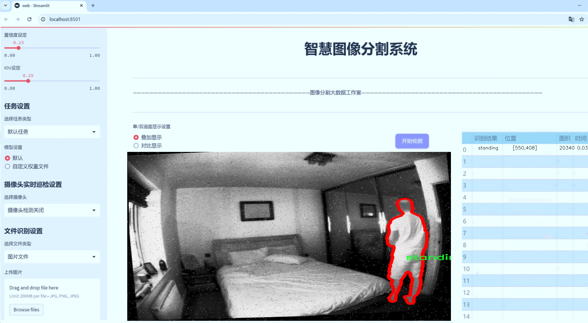
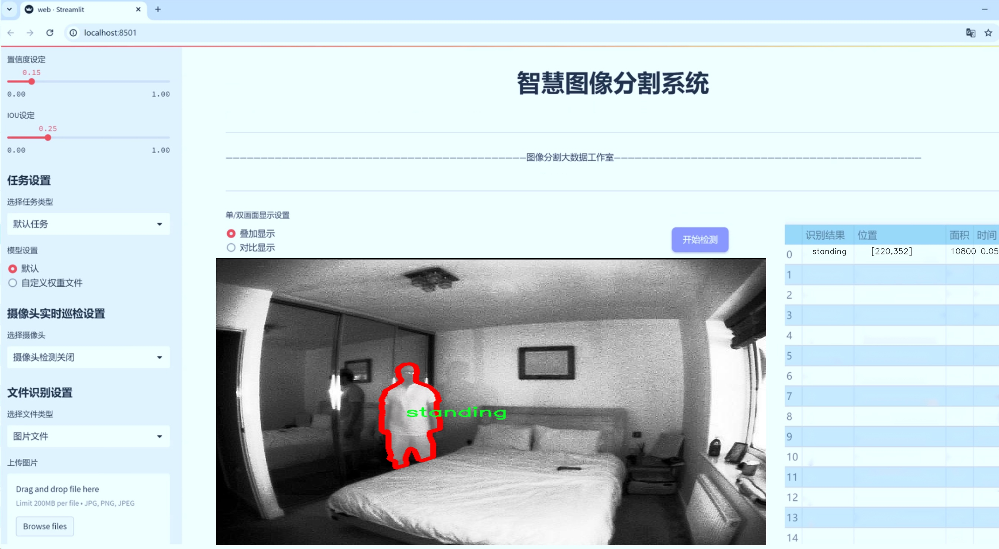
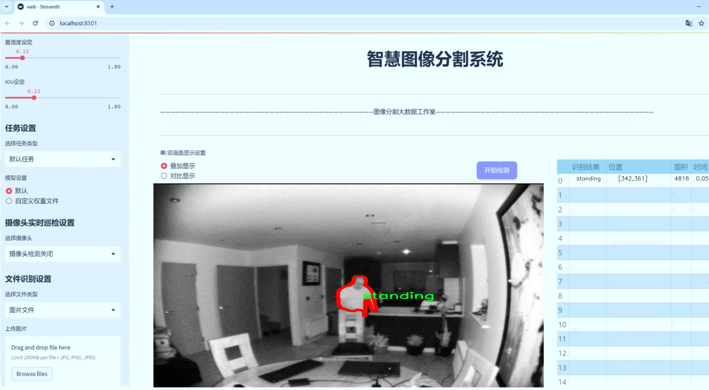
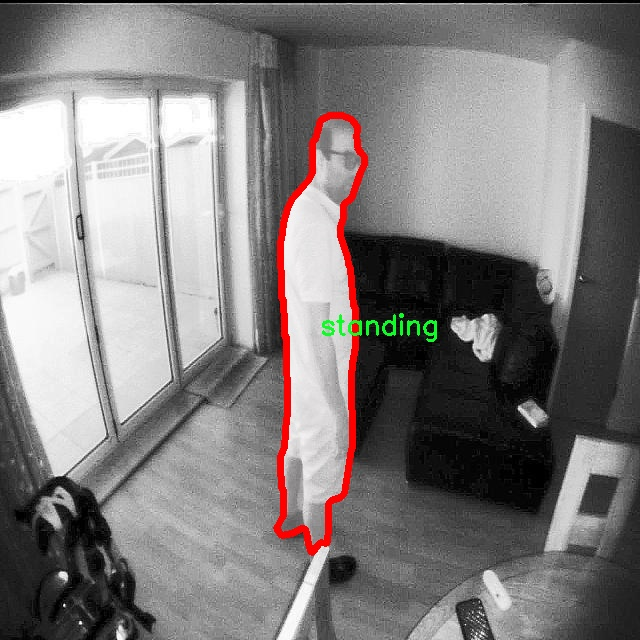
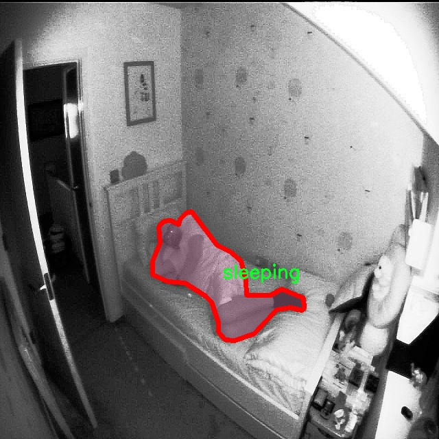
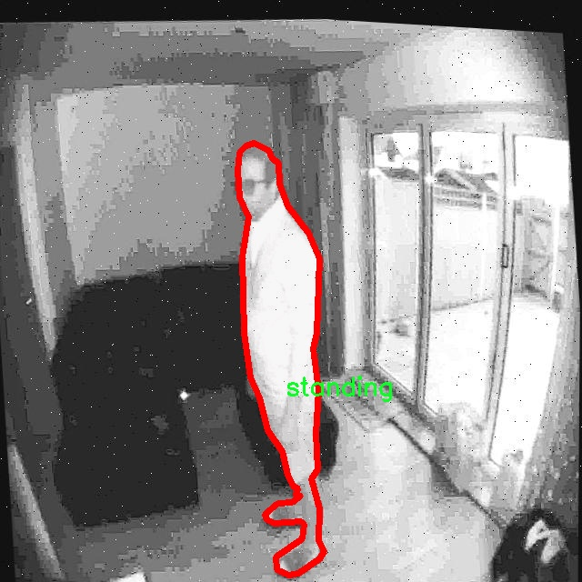
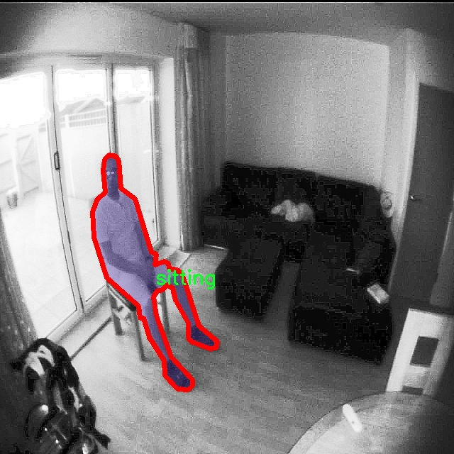
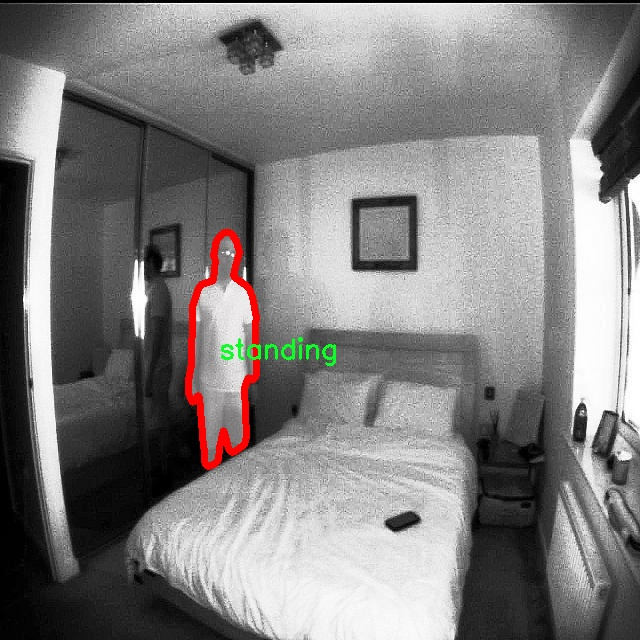

# 人类活动状态识别图像分割系统源码＆数据集分享
 [yolov8-seg-dyhead＆yolov8-seg-C2f-RFAConv等50+全套改进创新点发刊_一键训练教程_Web前端展示]

### 1.研究背景与意义

项目参考[ILSVRC ImageNet Large Scale Visual Recognition Challenge](https://gitee.com/YOLOv8_YOLOv11_Segmentation_Studio/projects)

项目来源[AAAI Global Al lnnovation Contest](https://kdocs.cn/l/cszuIiCKVNis)

研究背景与意义

随着社会的快速发展和科技的不断进步，人类活动状态识别技术在各个领域的应用日益广泛，尤其是在智能监控、健康管理和人机交互等方面。传统的活动识别方法多依赖于手工特征提取和简单的分类算法，然而，这些方法在复杂环境下的准确性和鲁棒性往往不足。近年来，深度学习技术的迅猛发展为活动状态识别提供了新的解决方案，尤其是基于卷积神经网络（CNN）的目标检测和图像分割模型，展现出了卓越的性能。其中，YOLO（You Only Look Once）系列模型因其高效的实时检测能力而备受关注。

YOLOv8作为YOLO系列的最新版本，结合了更为先进的网络结构和训练策略，能够在保持高精度的同时实现快速推理。针对人类活动状态识别的需求，改进YOLOv8模型以适应特定场景和任务，成为了研究的一个重要方向。本研究旨在基于改进YOLOv8模型，构建一个高效的人类活动状态识别图像分割系统，以实现对不同活动状态的准确识别和分割。

本研究所使用的数据集包含2800张图像，涵盖了五种主要的人类活动状态：跌倒、坐着、睡觉、站立和行走。这些活动状态不仅在日常生活中频繁出现，而且在安全监控和健康监测中具有重要的应用价值。例如，跌倒检测对于老年人和病患的安全至关重要，而坐着、睡觉、站立和行走等状态的监测则有助于评估个体的健康状况和生活习惯。通过对这些活动状态的准确识别，可以为智能家居、养老院监控以及医疗健康管理提供有力支持。

在研究过程中，我们将针对YOLOv8模型进行一系列改进，以提升其在特定活动状态识别任务中的表现。这包括优化网络结构、调整损失函数、增强数据集的多样性等。通过这些改进，我们期望能够提高模型对不同活动状态的识别精度和分割效果，进而实现更为准确和实时的活动监测。

此外，本研究的意义还在于推动人类活动状态识别技术的发展，为相关领域的研究提供新的思路和方法。随着数据集的不断扩展和模型性能的提升，未来的研究可以进一步探索更多复杂活动状态的识别，甚至实现对多种活动状态的同时监测。这将为智能监控系统的智能化和自动化提供重要的技术支持。

综上所述，基于改进YOLOv8的人类活动状态识别图像分割系统的研究，不仅具有重要的理论意义，也在实际应用中展现出广阔的前景。通过对人类活动状态的深入分析和识别，我们能够更好地理解和服务于人类生活的各个方面，为构建更加智能和安全的社会贡献力量。

### 2.图片演示







##### 注意：由于此博客编辑较早，上面“2.图片演示”和“3.视频演示”展示的系统图片或者视频可能为老版本，新版本在老版本的基础上升级如下：（实际效果以升级的新版本为准）

  （1）适配了YOLOV8的“目标检测”模型和“实例分割”模型，通过加载相应的权重（.pt）文件即可自适应加载模型。

  （2）支持“图片识别”、“视频识别”、“摄像头实时识别”三种识别模式。

  （3）支持“图片识别”、“视频识别”、“摄像头实时识别”三种识别结果保存导出，解决手动导出（容易卡顿出现爆内存）存在的问题，识别完自动保存结果并导出到tempDir中。

  （4）支持Web前端系统中的标题、背景图等自定义修改，后面提供修改教程。

  另外本项目提供训练的数据集和训练教程,暂不提供权重文件（best.pt）,需要您按照教程进行训练后实现图片演示和Web前端界面演示的效果。

### 3.视频演示

[3.1 视频演示](https://www.bilibili.com/video/BV1TmyHY4EAU/)

### 4.数据集信息展示

##### 4.1 本项目数据集详细数据（类别数＆类别名）

nc: 5
names: ['fall', 'sitting', 'sleeping', 'standing', 'walking']


##### 4.2 本项目数据集信息介绍

数据集信息展示

在本研究中，我们采用了名为“bllablallvbb”的数据集，以训练和改进YOLOv8-seg模型，旨在实现高效的人类活动状态识别图像分割系统。该数据集专门设计用于捕捉和分析五种主要的人类活动状态，包括跌倒（fall）、坐着（sitting）、睡觉（sleeping）、站立（standing）和行走（walking）。这些活动状态的选择不仅反映了日常生活中的常见行为，也为智能监控、老年人护理和人机交互等应用场景提供了重要的研究基础。

“bllablallvbb”数据集的类别数量为五个，涵盖了人类在不同情境下的行为表现。每个类别的图像样本均经过精心挑选，确保在多样性和代表性方面的均衡。这些样本不仅包括不同年龄、性别和体型的人类活动表现，还涵盖了各种环境条件下的活动状态，如室内、室外、光照变化等。这种多样性使得模型在训练过程中能够更好地学习到不同活动状态的特征，从而提高其在实际应用中的鲁棒性和准确性。

在数据集的构建过程中，所有图像均经过标注，确保每个活动状态在图像中的位置和范围清晰可辨。标注过程采用了先进的图像分割技术，使得模型不仅能够识别出活动的类别，还能准确地分割出活动的区域。这一特性对于后续的模型训练和评估至关重要，因为它使得模型能够在复杂场景中更好地理解和区分不同的活动状态。

为了进一步增强数据集的实用性和适应性，我们还引入了数据增强技术。这些技术包括随机裁剪、旋转、翻转、颜色变换等，旨在生成更多样化的训练样本。这一过程不仅增加了数据集的规模，也有效地提升了模型的泛化能力，使其能够在未见过的场景中依然保持较高的识别准确率。

在训练过程中，我们将使用该数据集对YOLOv8-seg模型进行细致的调优。通过对不同超参数的调整和模型架构的优化，我们期望能够实现更高的分割精度和更快的推理速度。此外，针对每种活动状态的特征，我们将设计特定的损失函数，以确保模型能够更好地捕捉到每种状态的细微差别。

总之，“bllablallvbb”数据集为本研究提供了一个坚实的基础，支持我们在改进YOLOv8-seg模型的过程中实现高效的人类活动状态识别。通过对数据集的深入分析和利用，我们期待能够推动智能监控和人机交互领域的发展，为社会的安全和便利做出贡献。











### 5.全套项目环境部署视频教程（零基础手把手教学）

[5.1 环境部署教程链接（零基础手把手教学）](https://www.bilibili.com/video/BV1jG4Ve4E9t/?vd_source=bc9aec86d164b67a7004b996143742dc)


[5.2 安装Python虚拟环境创建和依赖库安装视频教程链接（零基础手把手教学）](https://www.bilibili.com/video/BV1nA4VeYEze/?vd_source=bc9aec86d164b67a7004b996143742dc)

### 6.手把手YOLOV8-seg训练视频教程（零基础小白有手就能学会）

[6.1 手把手YOLOV8-seg训练视频教程（零基础小白有手就能学会）](https://www.bilibili.com/video/BV1cA4VeYETe/?vd_source=bc9aec86d164b67a7004b996143742dc)


按照上面的训练视频教程链接加载项目提供的数据集，运行train.py即可开始训练



     Epoch   gpu_mem       box       obj       cls    labels  img_size
     1/200     0G   0.01576   0.01955  0.007536        22      1280: 100%|██████████| 849/849 [14:42<00:00,  1.04s/it]
               Class     Images     Labels          P          R     mAP@.5 mAP@.5:.95: 100%|██████████| 213/213 [01:14<00:00,  2.87it/s]
                 all       3395      17314      0.994      0.957      0.0957      0.0843

     Epoch   gpu_mem       box       obj       cls    labels  img_size
     2/200     0G   0.01578   0.01923  0.007006        22      1280: 100%|██████████| 849/849 [14:44<00:00,  1.04s/it]
               Class     Images     Labels          P          R     mAP@.5 mAP@.5:.95: 100%|██████████| 213/213 [01:12<00:00,  2.95it/s]
                 all       3395      17314      0.996      0.956      0.0957      0.0845

     Epoch   gpu_mem       box       obj       cls    labels  img_size
     3/200     0G   0.01561    0.0191  0.006895        27      1280: 100%|██████████| 849/849 [10:56<00:00,  1.29it/s]
               Class     Images     Labels          P          R     mAP@.5 mAP@.5:.95: 100%|███████   | 187/213 [00:52<00:00,  4.04it/s]
                 all       3395      17314      0.996      0.957      0.0957      0.0845


### 7.50+种全套YOLOV8-seg创新点代码加载调参视频教程（一键加载写好的改进模型的配置文件）

[7.1 50+种全套YOLOV8-seg创新点代码加载调参视频教程（一键加载写好的改进模型的配置文件）](https://www.bilibili.com/video/BV1Hw4VePEXv/?vd_source=bc9aec86d164b67a7004b996143742dc)

### 8.YOLOV8-seg图像分割算法原理

原始YOLOv8-seg算法原理

YOLOv8-seg算法是YOLO系列目标检测模型的最新迭代，建立在YOLOv5的基础上，通过一系列创新和优化，旨在实现更高效的目标检测和分割任务。YOLOv8的架构主要由三个核心部分组成：主干网络（Backbone）、特征增强网络（Neck）和检测头（Head）。这些部分协同工作，使得YOLOv8不仅能够快速准确地检测目标，还能实现对目标的精细分割。

在主干网络部分，YOLOv8采用了CSPDarknet作为基础架构，进一步引入了C2f模块以替代YOLOv5中的C3模块。C2f模块的设计灵感来源于YOLOv7的ELAN结构，其通过引入多个分支和shortcut连接，显著提高了梯度流动性，从而缓解了深层网络中的梯度消失问题。C2f模块由多个CBS（卷积+归一化+SiLU激活）块和若干个Bottleneck组成，这种结构的优势在于能够有效提取多层次的特征信息，同时保持输入输出通道的一致性，使得特征的重用更加高效。

特征增强网络部分采用了PAN-FPN结构，旨在实现多尺度特征的深度融合。YOLOv8通过自下而上的特征融合策略，将高层特征与中层和浅层特征进行结合，确保不同尺度的信息能够充分利用。该结构不仅提高了特征融合的效率，还增强了模型对小目标的检测能力。通过这种方式，YOLOv8能够在复杂场景中更好地捕捉目标的细节信息和语义信息，提升检测的准确性。

在检测头部分，YOLOv8引入了解耦头的设计，替代了传统的耦合头结构。这一创新使得分类和回归任务能够独立进行，从而减少了任务之间的干扰，提高了模型在复杂场景下的定位精度和分类准确性。YOLOv8采用了Anchor-Free的目标检测方法，摒弃了传统的锚框机制，直接通过回归方式预测目标的位置和大小。这种方法的优势在于简化了模型的设计，减少了对锚框选择和调整的依赖，使得模型在处理不同尺度和形状的目标时更加灵活。

YOLOv8的损失函数设计也进行了优化，采用了VFLLoss作为分类损失，DFLLoss和CIoULoss作为回归损失。这种组合损失函数能够有效处理样本不平衡问题，尤其是在小目标检测中，能够更好地引导模型学习困难样本。此外，YOLOv8在样本匹配策略上也进行了改进，从静态匹配转变为Task-Aligned的匹配方式，以提高训练的效率和效果。

在数据预处理方面，YOLOv8延续了YOLOv5的策略，采用了马赛克增强、混合增强、空间扰动和颜色扰动等多种数据增强手段。这些增强技术能够有效提高模型的鲁棒性，使其在各种复杂环境下都能保持良好的检测性能。

YOLOv8-seg的整体架构和设计理念体现了当前目标检测领域的前沿趋势，尤其是在轻量化和高效性方面的追求。通过对网络结构的精细调整和创新，YOLOv8不仅在速度和精度上实现了显著提升，还为实时目标检测和分割任务提供了强有力的支持。随着YOLOv8的推出，目标检测技术的应用场景将更加广泛，能够满足更多实际需求，推动智能视觉技术的发展。

总的来说，YOLOv8-seg算法通过对主干网络、特征增强网络和检测头的深度优化，结合Anchor-Free检测方法和创新的损失函数设计，展现了其在目标检测和分割任务中的强大能力。其轻量化的特性使得该模型能够在嵌入式设备上高效运行，满足实时检测的需求，为未来的研究和应用奠定了坚实的基础。


### 9.系统功能展示（检测对象为举例，实际内容以本项目数据集为准）

图9.1.系统支持检测结果表格显示

  图9.2.系统支持置信度和IOU阈值手动调节

  图9.3.系统支持自定义加载权重文件best.pt(需要你通过步骤5中训练获得)

  图9.4.系统支持摄像头实时识别

  图9.5.系统支持图片识别

  图9.6.系统支持视频识别

  图9.7.系统支持识别结果文件自动保存

  图9.8.系统支持Excel导出检测结果数据


### 10.50+种全套YOLOV8-seg创新点原理讲解（非科班也可以轻松写刊发刊，V11版本正在科研待更新）

#### 10.1 由于篇幅限制，每个创新点的具体原理讲解就不一一展开，具体见下列网址中的创新点对应子项目的技术原理博客网址【Blog】：


[10.1 50+种全套YOLOV8-seg创新点原理讲解链接](https://gitee.com/qunmasj/good)

#### 10.2 部分改进模块原理讲解(完整的改进原理见上图和技术博客链接)【如果此小节的图加载失败可以通过CSDN或者Github搜索该博客的标题访问原始博客，原始博客图片显示正常】
### YOLOv8模型原理

YOLOv8是YOLO系列最新的模型,具有非常优秀的检测精度和速度。根据网络的深度与特征图的宽度大小, YOLOv8算法分为:YOLOv8-n、YOLOv8一s 、YOLOv8-m 、 YOLOv8-l、和 YOLOv8-x 5个版本。按照网络结构图,YOLOv8可分为: Inpul 、 Backbone , Neck和Head 4部分。


Backbone采用了CSPDarknet 架构，由CBS (标准卷积层)、C2f模块和 SPPF(金字塔池化）组成。通过5次标准卷积层和C2f模块逐步提取图像特征，并在网络末尾添加SPPF模块，将任意大小的输入图像转换成固定大小的特征向量。分别取P3、P4、P5层的特征提取结果，向Head输出80×80、40 × 40、20×20三个尺度的特征层。
C2f模块借鉴了残差网络(ResNet)以及ELAN的思想，其结构分为两个分支，主干部分利用Bottleneckm2%模块逐步加深网络，分支部分保留输入层通道并与主干部分特征进行融合，如图所示。通过标准卷积层提取新的特征层，相比于YOLOv5使用的C3模块，C2f模块可以在卷积层和全连接层之间建立一个平滑的转换，从而实现了参数的共享，提高了模型的效率和泛化能力。
Head采用了PAN-FPN 结构,将 Backbone输入的3个特征层进行多尺度融合，进行自顶向下(FAN)和自底向上 (PAN)的特征传递，对金字塔进行增强，使不同尺寸的特征图都包含强目标语义信息和强目标特征信息，保证了对不同尺寸样本的准确预测。
Detect借鉴了Decoupled-Head 思想，用一个解耦检测头将输入的不同尺寸特征层分成2个分支进行检测。第1个分支在进行3次卷积后使进行回归任务，输出预测框。第2个分支在进行3次卷积后进行分类任务，输出类别的概率。采用Varifocal_Loss2”作为损失函数，其式为:


### Context_Grided_Network(CGNet)简介
参考该博客提出的一种轻量化语义分割模型Context Grided Network(CGNet)，以满足设备的运行需要。

CGNet主要由CG块构建而成，CG块可以学习局部特征和周围环境上下文的联合特征，最后通过引入全局上下文特征进一步改善联合特征的学习。


 
下图给出了在Cityscapes数据集上对现有的一些语义分割模型的测试效果，横轴表示参数量，纵轴表示准确率(mIoU)。可以看出，在参数量较少的情况下，CGNet可以达到一个比较好的准确率。虽与高精度模型相去甚远，但在一些对精度要求不高、对实时性要求比较苛刻的情况下，很有价值。


高精度模型，如DeepLab、DFN、DenseASPP等，动不动就是几十M的参数，很难应用在移动设备上。而上图中红色的模型，相对内存占用较小，但它们的分割精度却不是很高。作者认为主要原因是，这些小网络大多遵循着分类网络的设计思路，并没有考虑语义分割任务更深层次的特点。

空间依赖性和上下文信息对提高分割精度有很大的作用。作者从该角度出发，提出了CG block，并进一步搭建了轻量级语义分割网络CGNet。CG块具有以下特点： 

学习局部特征和上下文特征的联合特征；
通过全局上下文特征改进上述联合特征；
可以贯穿应用在整个网络中，从low level（空间级别）到high level（语义级别）。不像PSPNet、DFN、DenseASPP等，只在编码阶段以后捕捉上下文特征。；
只有3个下采样，相比一般5个下采样的网络，能够更好地保留边缘信息。
CGNet遵循“深而薄”的原则设计，整个网络又51层构成。其中，为了降低计算，大量使用了channel-wise conv.

小型语义分割模型：

需要平衡准确率和系统开销
进化路线：ENet -> ICNet -> ESPNet
这些模型基本都基于分类网络设计，在分割准确率上效果并不是很好
上下文信息模型：

大多数现有模型只考虑解码阶段的上下文信息并且没有利用周围的上下文信息
注意力机制：

CG block使用全局上下文信息计算权重向量，并使用其细化局部特征和周围上下文特征的联合特征

#### Context Guided Block
CG block由4部分组成：


此外，CG block还采用了残差学习。文中提出了局部残差学习（LRL）和全局残差学习（GRL）两种方式。 LRL添加了从输入到联合特征提取器的连接，GRL添加了从输入到全局特征提取器的连接。从直观上来说，GRL比LRL更能促进网络中的信息传递（更像ResNet~~），后面实验部分也进行了测试，的确GRL更能提升分割精度。


CGNet的通用网络结构如下图所示，分为3个stage，第一个stage使用3个卷积层抽取特征，第二和第三个stage堆叠一定数量的CG block，具体个数可以根据情况调整。最后，通过1x1 conv得到分割结果。


下图是用于Cityscapes数据集的CGNet网络细节说明：输入尺寸为3*680*680；stage1连续使用了3个Conv-BN-PReLU组合，首个组合使用了stride=2的卷积，所以得到了1/2分辨率的feature map；stage2和stage3分别使用了多个CG block，且其中使用了不同大小的膨胀卷积核，最终分别得到了1/4和1/8的feature map。

需注意：

stage2&3的输入特征分别由其上一个stage的首个和最后一个block组合给出（参考上图的绿色箭头）；

输入注入机制，图中未体现，实际使用中，作者还将输入图像下采样1/4或1/8，分别给到stage2和stage3的输入中 ，以进一步加强特征传递。

channel-wise conv。为了缩减参数数量，在局部特征提取器和周围上下文特征提取器中使用了channel-wise卷积，可以消除跨通道的计算成本，同时节省内存占用。但是，没有像MobileNet等模型一样，在depth-wise卷积后面接point-wise卷积（1*1 conv），作者解释是，因为CG block需要保持局部特征和周围上下文特征的独立性，而1*1 conv会破坏这种独立性，所以效果欠佳，实验部分也进行了验证。

个人感觉此处应该指的是depth-wise卷积？

官方Git中对该部分的实现如下：


### 11.项目核心源码讲解（再也不用担心看不懂代码逻辑）

#### 11.1 ultralytics\models\fastsam\model.py

以下是经过简化和注释的核心代码部分：

```python
# 导入必要的库
from pathlib import Path
from ultralytics.engine.model import Model
from .predict import FastSAMPredictor
from .val import FastSAMValidator

class FastSAM(Model):
    """
    FastSAM模型接口示例。
    
    使用示例：
        ```python
        from ultralytics import FastSAM

        model = FastSAM('last.pt')  # 加载模型
        results = model.predict('ultralytics/assets/bus.jpg')  # 进行预测
        ```
    """

    def __init__(self, model='FastSAM-x.pt'):
        """初始化FastSAM模型，调用父类Model的初始化方法。
        
        参数:
            model (str): 模型文件名，默认为'FastSAM-x.pt'。
        """
        # 如果传入的模型是'FastSAM.pt'，则使用'FastSAM-x.pt'
        if str(model) == 'FastSAM.pt':
            model = 'FastSAM-x.pt'
        
        # 确保模型文件不是yaml格式
        assert Path(model).suffix not in ('.yaml', '.yml'), 'FastSAM模型仅支持预训练模型。'
        
        # 调用父类的初始化方法
        super().__init__(model=model, task='segment')

    @property
    def task_map(self):
        """返回一个字典，将分割任务映射到相应的预测器和验证器类。"""
        return {
            'segment': {
                'predictor': FastSAMPredictor,  # 预测器类
                'validator': FastSAMValidator     # 验证器类
            }
        }
```

### 代码注释说明：
1. **导入部分**：导入所需的库和模块，包括路径处理、基础模型类以及预测和验证的类。
2. **类定义**：`FastSAM`类继承自`Model`类，表示FastSAM模型的接口。
3. **初始化方法**：`__init__`方法用于初始化模型，设置默认模型文件，并确保文件格式正确。
4. **属性方法**：`task_map`属性返回一个字典，映射任务类型到相应的预测器和验证器类，便于后续的模型使用。

这个文件定义了一个名为 `FastSAM` 的类，它是一个用于图像分割的模型接口，继承自 `Model` 类。文件开头包含了一些必要的导入，包括路径处理和父类模型的引入，以及两个用于预测和验证的类 `FastSAMPredictor` 和 `FastSAMValidator`。

在 `FastSAM` 类的文档字符串中，提供了一个简单的使用示例，展示了如何实例化模型并进行预测。用户可以通过传入模型文件的路径来创建 `FastSAM` 的实例，并使用 `predict` 方法对图像进行处理。

构造函数 `__init__` 中，首先检查传入的模型名称，如果是默认的 `FastSAM.pt`，则将其替换为 `FastSAM-x.pt`。接着，使用断言确保传入的模型文件后缀不是 YAML 格式，因为 `FastSAM` 模型只支持预训练模型。最后，调用父类的构造函数，指定模型和任务类型为“分割”。

`task_map` 属性返回一个字典，将分割任务映射到相应的预测器和验证器类。这为后续的预测和验证操作提供了灵活性，使得模型可以根据不同的任务类型调用相应的处理类。

总体来说，这个文件的主要功能是定义和初始化一个图像分割模型，并提供相应的预测和验证工具，以便于用户在图像处理任务中使用。

#### 11.2 ui.py

```python
import sys
import subprocess

def run_script(script_path):
    """
    使用当前 Python 环境运行指定的脚本。

    Args:
        script_path (str): 要运行的脚本路径

    Returns:
        None
    """
    # 获取当前 Python 解释器的路径
    python_path = sys.executable

    # 构建运行命令
    command = f'"{python_path}" -m streamlit run "{script_path}"'

    # 执行命令
    result = subprocess.run(command, shell=True)
    if result.returncode != 0:
        print("脚本运行出错。")


# 实例化并运行应用
if __name__ == "__main__":
    # 指定您的脚本路径
    script_path = "web.py"  # 这里可以直接指定脚本名称

    # 运行脚本
    run_script(script_path)
```

### 代码注释说明：

1. **导入模块**：
   - `import sys`：导入系统相关的模块，用于获取当前 Python 解释器的路径。
   - `import subprocess`：导入子进程模块，用于在 Python 中执行外部命令。

2. **定义函数 `run_script`**：
   - 该函数接收一个参数 `script_path`，表示要运行的 Python 脚本的路径。
   - 使用 `sys.executable` 获取当前 Python 解释器的路径，以便在命令中调用。
   - 构建一个命令字符串，使用 `streamlit` 模块运行指定的脚本。
   - 使用 `subprocess.run` 执行构建的命令，并检查返回码以确定脚本是否成功运行。

3. **主程序入口**：
   - 使用 `if __name__ == "__main__":` 确保只有在直接运行该脚本时才会执行以下代码。
   - 指定要运行的脚本路径 `script_path`，这里可以直接写成 `"web.py"`。
   - 调用 `run_script` 函数来执行指定的脚本。

这个程序文件的主要功能是使用当前的 Python 环境来运行一个指定的脚本，具体来说是运行一个名为 `web.py` 的脚本。程序首先导入了必要的模块，包括 `sys`、`os` 和 `subprocess`，以及一个自定义的 `abs_path` 函数，用于获取文件的绝对路径。

在 `run_script` 函数中，首先获取当前 Python 解释器的路径，这样可以确保使用正确的 Python 环境来执行脚本。接着，构建一个命令字符串，这个命令将调用 `streamlit` 模块来运行指定的脚本。`streamlit` 是一个用于构建数据应用的流行库。

使用 `subprocess.run` 方法执行构建好的命令。这个方法会在一个新的 shell 中运行命令，并等待其完成。如果脚本运行过程中出现错误，返回的 `returncode` 将不为零，程序会打印出“脚本运行出错”的提示。

在文件的最后部分，使用 `if __name__ == "__main__":` 语句来确保只有在直接运行该文件时才会执行后面的代码。此时，指定了要运行的脚本路径为 `web.py`，并调用 `run_script` 函数来执行这个脚本。

总的来说，这个程序提供了一种简单的方式来运行指定的 Python 脚本，特别是用于启动基于 Streamlit 的 web 应用。

#### 11.3 ultralytics\models\yolo\classify\train.py

以下是代码中最核心的部分，并附上详细的中文注释：

```python
import torch
from ultralytics.data import ClassificationDataset, build_dataloader
from ultralytics.engine.trainer import BaseTrainer
from ultralytics.models import yolo
from ultralytics.nn.tasks import ClassificationModel, attempt_load_one_weight
from ultralytics.utils import DEFAULT_CFG, LOGGER, RANK, colorstr
from ultralytics.utils.torch_utils import is_parallel, strip_optimizer, torch_distributed_zero_first

class ClassificationTrainer(BaseTrainer):
    """
    继承自 BaseTrainer 类的分类训练器，用于基于分类模型的训练。
    """

    def __init__(self, cfg=DEFAULT_CFG, overrides=None, _callbacks=None):
        """初始化 ClassificationTrainer 对象，支持配置覆盖和回调函数。"""
        if overrides is None:
            overrides = {}
        overrides['task'] = 'classify'  # 设置任务类型为分类
        if overrides.get('imgsz') is None:
            overrides['imgsz'] = 224  # 默认图像大小为224
        super().__init__(cfg, overrides, _callbacks)  # 调用父类构造函数

    def set_model_attributes(self):
        """从加载的数据集中设置 YOLO 模型的类名。"""
        self.model.names = self.data['names']  # 将数据集中的类名赋值给模型

    def get_model(self, cfg=None, weights=None, verbose=True):
        """返回配置好的 PyTorch 模型以进行 YOLO 训练。"""
        model = ClassificationModel(cfg, nc=self.data['nc'], verbose=verbose and RANK == -1)  # 创建分类模型
        if weights:
            model.load(weights)  # 加载权重

        for m in model.modules():
            if not self.args.pretrained and hasattr(m, 'reset_parameters'):
                m.reset_parameters()  # 重置模型参数
            if isinstance(m, torch.nn.Dropout) and self.args.dropout:
                m.p = self.args.dropout  # 设置 dropout 概率
        for p in model.parameters():
            p.requires_grad = True  # 设置参数可训练
        return model

    def build_dataset(self, img_path, mode='train', batch=None):
        """根据图像路径和模式（训练/测试等）创建 ClassificationDataset 实例。"""
        return ClassificationDataset(root=img_path, args=self.args, augment=mode == 'train', prefix=mode)

    def get_dataloader(self, dataset_path, batch_size=16, rank=0, mode='train'):
        """返回带有图像预处理变换的 PyTorch DataLoader。"""
        with torch_distributed_zero_first(rank):  # 如果使用分布式数据并行，只初始化一次数据集
            dataset = self.build_dataset(dataset_path, mode)  # 构建数据集

        loader = build_dataloader(dataset, batch_size, self.args.workers, rank=rank)  # 创建数据加载器
        return loader  # 返回数据加载器

    def preprocess_batch(self, batch):
        """预处理一批图像和类标签。"""
        batch['img'] = batch['img'].to(self.device)  # 将图像移动到设备上
        batch['cls'] = batch['cls'].to(self.device)  # 将类标签移动到设备上
        return batch

    def get_validator(self):
        """返回 ClassificationValidator 实例以进行验证。"""
        self.loss_names = ['loss']  # 定义损失名称
        return yolo.classify.ClassificationValidator(self.test_loader, self.save_dir)  # 返回验证器

    def final_eval(self):
        """评估训练后的模型并保存验证结果。"""
        for f in self.last, self.best:
            if f.exists():
                strip_optimizer(f)  # 去除优化器信息
                if f is self.best:
                    LOGGER.info(f'\nValidating {f}...')
                    self.metrics = self.validator(model=f)  # 使用验证器评估模型
                    self.metrics.pop('fitness', None)  # 移除 'fitness' 指标
        LOGGER.info(f"Results saved to {colorstr('bold', self.save_dir)}")  # 打印结果保存路径
```

### 代码核心部分说明：
1. **导入必要的库**：引入 PyTorch 和 Ultralytics 相关模块。
2. **ClassificationTrainer 类**：继承自 `BaseTrainer`，用于处理分类任务的训练。
3. **初始化方法**：设置任务类型、图像大小等参数。
4. **模型设置**：加载和配置模型，包括权重和参数设置。
5. **数据集和数据加载器**：构建数据集和数据加载器，支持训练和验证模式。
6. **预处理**：将图像和标签移动到指定设备（如 GPU）。
7. **验证和评估**：提供验证器实例和最终评估模型的功能。

这个程序文件是一个用于训练分类模型的类，名为 `ClassificationTrainer`，它继承自 `BaseTrainer` 类。该类主要用于使用 YOLO（You Only Look Once）模型进行图像分类任务。文件中导入了多个模块，包括 PyTorch、Torchvision 以及 Ultralytics 库中的一些功能模块。

在类的初始化方法中，设置了一些默认参数，如图像大小（默认为 224），并将任务类型设置为分类。这个类允许用户通过 `overrides` 参数来覆盖默认配置。

`set_model_attributes` 方法用于从加载的数据集中设置模型的类别名称。`get_model` 方法则返回一个配置好的 PyTorch 模型，并根据需要加载权重。该方法还会重置模型中的某些参数，特别是如果用户没有使用预训练模型时。

`setup_model` 方法负责加载或创建模型。如果模型是以 `.pt` 文件形式存在，它会尝试加载该权重文件；如果是 YAML 格式的配置文件，则会调用 `get_model` 方法获取模型；如果是 Torchvision 中的模型名称，则直接从 Torchvision 加载相应的模型。最后，该方法会调用 `reshape_outputs` 来调整模型的输出，以适应分类任务。

`build_dataset` 方法用于创建一个分类数据集的实例，支持不同的模式（如训练或测试）。`get_dataloader` 方法则返回一个 PyTorch 的数据加载器，用于在推理时对图像进行预处理。它还支持分布式训练的初始化。

`preprocess_batch` 方法用于将图像和类别数据移动到指定的设备上（如 GPU）。`progress_string` 方法返回一个格式化的字符串，用于显示训练进度。

`get_validator` 方法返回一个用于验证的分类验证器实例。`label_loss_items` 方法用于返回带标签的训练损失项字典，尽管对于分类任务来说，这个方法并不是必需的。

`plot_metrics` 方法用于从 CSV 文件中绘制指标图。`final_eval` 方法用于评估训练好的模型并保存验证结果。它会在验证时去掉优化器信息，并记录验证结果。

最后，`plot_training_samples` 方法用于绘制带有注释的训练样本图像，帮助用户可视化训练过程中的样本。

整体来看，这个文件提供了一个完整的框架，用于训练和评估基于 YOLO 的图像分类模型，包含了数据处理、模型加载、训练进度显示、验证和结果可视化等功能。

#### 11.4 ultralytics\solutions\ai_gym.py

以下是经过简化并添加详细中文注释的核心代码部分：

```python
import cv2
from ultralytics.utils.plotting import Annotator

class AIGym:
    """管理实时视频流中基于姿势的健身步骤的类。"""

    def __init__(self):
        """初始化AIGym，设置视觉和图像参数的默认值。"""
        self.im0 = None  # 当前帧图像
        self.tf = None   # 线条厚度
        self.keypoints = None  # 姿势关键点
        self.poseup_angle = None  # 上升姿势的角度阈值
        self.posedown_angle = None  # 下降姿势的角度阈值
        self.angle = None  # 当前角度
        self.count = None  # 当前计数
        self.stage = None  # 当前阶段（上/下）
        self.pose_type = 'pushup'  # 姿势类型（如俯卧撑）
        self.kpts_to_check = None  # 需要检查的关键点
        self.view_img = False  # 是否显示图像
        self.annotator = None  # 注释器实例

    def set_args(self, kpts_to_check, line_thickness=2, view_img=False, pose_up_angle=145.0, pose_down_angle=90.0, pose_type='pullup'):
        """
        配置AIGym的参数。
        Args:
            kpts_to_check (list): 用于计数的3个关键点
            line_thickness (int): 边界框的线条厚度
            view_img (bool): 是否显示图像
            pose_up_angle (float): 设置上升姿势的角度
            pose_down_angle (float): 设置下降姿势的角度
            pose_type: "pushup", "pullup" 或 "abworkout"
        """
        self.kpts_to_check = kpts_to_check
        self.tf = line_thickness
        self.view_img = view_img
        self.poseup_angle = pose_up_angle
        self.posedown_angle = pose_down_angle
        self.pose_type = pose_type

    def start_counting(self, im0, results, frame_count):
        """
        计数健身步骤的函数。
        Args:
            im0 (ndarray): 当前视频流帧
            results: 姿势估计数据
            frame_count: 当前帧计数
        """
        self.im0 = im0  # 保存当前帧图像
        if frame_count == 1:
            # 初始化计数和角度
            self.count = [0] * len(results[0])
            self.angle = [0] * len(results[0])
            self.stage = ['-' for _ in results[0]]
        
        self.keypoints = results[0].keypoints.data  # 获取关键点数据
        self.annotator = Annotator(im0, line_width=2)  # 创建注释器实例

        # 遍历每个关键点
        for ind, k in enumerate(reversed(self.keypoints)):
            # 计算姿势角度
            self.angle[ind] = self.annotator.estimate_pose_angle(
                k[int(self.kpts_to_check[0])].cpu(),
                k[int(self.kpts_to_check[1])].cpu(),
                k[int(self.kpts_to_check[2])].cpu()
            )
            self.im0 = self.annotator.draw_specific_points(k, self.kpts_to_check, shape=(640, 640), radius=10)

            # 根据姿势类型更新计数和阶段
            if self.pose_type == 'pushup':
                if self.angle[ind] > self.poseup_angle:
                    self.stage[ind] = 'up'
                if self.angle[ind] < self.posedown_angle and self.stage[ind] == 'up':
                    self.stage[ind] = 'down'
                    self.count[ind] += 1

            elif self.pose_type == 'pullup':
                if self.angle[ind] > self.poseup_angle:
                    self.stage[ind] = 'down'
                if self.angle[ind] < self.posedown_angle and self.stage[ind] == 'down':
                    self.stage[ind] = 'up'
                    self.count[ind] += 1

            # 绘制角度、计数和阶段信息
            self.annotator.plot_angle_and_count_and_stage(
                angle_text=self.angle[ind],
                count_text=self.count[ind],
                stage_text=self.stage[ind],
                center_kpt=k[int(self.kpts_to_check[1])],
                line_thickness=self.tf
            )

            # 绘制关键点
            self.annotator.kpts(k, shape=(640, 640), radius=1, kpt_line=True)

        # 如果需要显示图像，则使用OpenCV显示
        if self.view_img:
            cv2.imshow('Ultralytics YOLOv8 AI GYM', self.im0)
            if cv2.waitKey(1) & 0xFF == ord('q'):
                return

if __name__ == '__main__':
    AIGym()  # 创建AIGym实例
```

### 代码说明：
1. **类的定义**：`AIGym`类用于管理健身动作的计数和状态。
2. **初始化方法**：`__init__`方法中定义了类的基本属性，包括图像、关键点、计数、角度和阶段等。
3. **设置参数**：`set_args`方法用于配置关键点、线条厚度、显示图像的选项以及姿势的上下角度阈值。
4. **计数方法**：`start_counting`方法负责处理每一帧图像，计算姿势角度，更新计数和阶段，并在图像上绘制相关信息。
5. **显示图像**：如果设置了显示图像的选项，则使用OpenCV显示当前帧，并在按下'q'键时退出。

这个程序文件定义了一个名为 `AIGym` 的类，主要用于在实时视频流中基于人体姿态来管理健身动作的计数。程序的核心功能是通过姿态估计来识别和计数用户在进行特定健身动作（如俯卧撑、引体向上或腹部锻炼）的次数。

在类的初始化方法 `__init__` 中，设置了一些默认值，包括图像处理参数、关键点信息、计数和角度信息等。具体来说，`im0` 用于存储当前帧图像，`tf` 是线条的厚度，`keypoints` 存储关键点数据，`poseup_angle` 和 `posedown_angle` 分别定义了姿势的上限和下限角度，`count` 和 `stage` 用于记录每个动作的计数和当前阶段。

`set_args` 方法用于配置 `AIGym` 的一些参数，包括需要检查的关键点、线条厚度、是否显示图像、姿势的上下角度以及动作类型（如俯卧撑、引体向上或腹部锻炼）。这些参数的设置将影响后续的姿态估计和计数逻辑。

`start_counting` 方法是该类的核心功能，用于处理每一帧图像，进行姿态估计并计数。该方法接收当前帧图像 `im0`、姿态估计结果 `results` 和当前帧计数 `frame_count`。在方法内部，首先会初始化计数和角度信息，然后通过 `Annotator` 类对关键点进行可视化处理。根据不同的动作类型，程序会计算关键点之间的角度，并根据设定的上下角度来判断当前的动作阶段（如“上”或“下”）。每当完成一个完整的动作时，计数器会增加。

最后，如果设置了 `view_img` 为 `True`，程序会使用 OpenCV 显示当前处理的图像，并允许用户通过按下 'q' 键退出显示。

总的来说，这个程序文件实现了一个简单的健身动作计数器，通过实时视频流分析用户的姿态，帮助用户跟踪自己的锻炼进度。

#### 11.5 ultralytics\models\fastsam\utils.py

以下是代码中最核心的部分，并附上详细的中文注释：

```python
import torch

def adjust_bboxes_to_image_border(boxes, image_shape, threshold=20):
    """
    调整边界框，使其在距离图像边界一定阈值内时贴近边界。

    参数:
        boxes (torch.Tensor): 边界框的坐标，形状为(n, 4)
        image_shape (tuple): 图像的高度和宽度，形状为(height, width)
        threshold (int): 像素阈值

    返回:
        adjusted_boxes (torch.Tensor): 调整后的边界框
    """

    # 获取图像的高度和宽度
    h, w = image_shape

    # 调整边界框的坐标
    boxes[boxes[:, 0] < threshold, 0] = 0  # 将左上角x坐标小于阈值的边界框调整为0
    boxes[boxes[:, 1] < threshold, 1] = 0  # 将左上角y坐标小于阈值的边界框调整为0
    boxes[boxes[:, 2] > w - threshold, 2] = w  # 将右下角x坐标大于图像宽度减去阈值的边界框调整为图像宽度
    boxes[boxes[:, 3] > h - threshold, 3] = h  # 将右下角y坐标大于图像高度减去阈值的边界框调整为图像高度
    return boxes


def bbox_iou(box1, boxes, iou_thres=0.9, image_shape=(640, 640), raw_output=False):
    """
    计算一个边界框与其他边界框的交并比（IoU）。

    参数:
        box1 (torch.Tensor): 单个边界框的坐标，形状为(4, )
        boxes (torch.Tensor): 一组边界框的坐标，形状为(n, 4)
        iou_thres (float): IoU阈值
        image_shape (tuple): 图像的高度和宽度，形状为(height, width)
        raw_output (bool): 如果为True，返回原始的IoU值而不是索引

    返回:
        high_iou_indices (torch.Tensor): IoU大于阈值的边界框索引
    """
    # 调整边界框，使其贴近图像边界
    boxes = adjust_bboxes_to_image_border(boxes, image_shape)

    # 计算交集的坐标
    x1 = torch.max(box1[0], boxes[:, 0])  # 交集左上角x坐标
    y1 = torch.max(box1[1], boxes[:, 1])  # 交集左上角y坐标
    x2 = torch.min(box1[2], boxes[:, 2])  # 交集右下角x坐标
    y2 = torch.min(box1[3], boxes[:, 3])  # 交集右下角y坐标

    # 计算交集的面积
    intersection = (x2 - x1).clamp(0) * (y2 - y1).clamp(0)

    # 计算两个边界框的面积
    box1_area = (box1[2] - box1[0]) * (box1[3] - box1[1])  # box1的面积
    box2_area = (boxes[:, 2] - boxes[:, 0]) * (boxes[:, 3] - boxes[:, 1])  # boxes的面积

    # 计算并集的面积
    union = box1_area + box2_area - intersection

    # 计算IoU
    iou = intersection / union  # IoU值，形状为(n, )
    if raw_output:
        return 0 if iou.numel() == 0 else iou  # 如果需要原始IoU值，直接返回

    # 返回IoU大于阈值的边界框索引
    return torch.nonzero(iou > iou_thres).flatten()
```

### 代码说明：
1. **adjust_bboxes_to_image_border** 函数用于调整边界框的位置，使其在距离图像边界一定阈值内时，强制将其移动到边界上。
2. **bbox_iou** 函数计算一个边界框与一组边界框之间的交并比（IoU），并返回与给定边界框的IoU值大于指定阈值的边界框索引。通过调整边界框位置，确保计算的准确性。

这个程序文件是一个用于处理目标检测中边界框（bounding boxes）的工具类，主要包含两个函数：`adjust_bboxes_to_image_border` 和 `bbox_iou`。

首先，`adjust_bboxes_to_image_border` 函数的作用是调整边界框的位置，使其在图像边界内。如果边界框的某个边距图像边界的距离小于设定的阈值（`threshold`），则将该边界框的相应坐标调整到图像边界上。函数接收三个参数：`boxes` 是一个形状为 (n, 4) 的张量，表示 n 个边界框的坐标；`image_shape` 是一个元组，包含图像的高度和宽度；`threshold` 是一个整数，表示阈值。函数返回调整后的边界框。

接下来，`bbox_iou` 函数用于计算一个边界框与一组其他边界框之间的交并比（IoU）。该函数接收多个参数：`box1` 是一个形状为 (4,) 的张量，表示待计算的边界框；`boxes` 是一个形状为 (n, 4) 的张量，表示其他 n 个边界框；`iou_thres` 是一个浮点数，表示 IoU 的阈值；`image_shape` 是图像的高度和宽度；`raw_output` 是一个布尔值，指示是否返回原始的 IoU 值。函数首先调用 `adjust_bboxes_to_image_border` 来确保所有边界框都在图像边界内。然后，它计算边界框之间的交集区域，接着计算每个边界框的面积，并最终计算出交并比。根据 `raw_output` 的值，函数可以返回满足 IoU 大于阈值的边界框的索引，或者返回原始的 IoU 值。

整体来看，这个文件提供了处理边界框的基本工具，适用于目标检测任务中的边界框调整和相似度计算。

#### 11.6 ultralytics\nn\extra_modules\kernel_warehouse.py

以下是代码中最核心的部分，并附上详细的中文注释：

```python
import torch
import torch.nn as nn
import torch.nn.functional as F

class Attention(nn.Module):
    def __init__(self, in_planes, reduction, num_static_cell, num_local_mixture, norm_layer=nn.BatchNorm1d,
                 cell_num_ratio=1.0, nonlocal_basis_ratio=1.0, start_cell_idx=None):
        super(Attention, self).__init__()
        # 计算隐藏层的通道数
        hidden_planes = max(int(in_planes * reduction), 16)
        self.kw_planes_per_mixture = num_static_cell + 1  # 每个混合的关键字平面数
        self.num_local_mixture = num_local_mixture  # 本地混合数
        self.kw_planes = self.kw_planes_per_mixture * num_local_mixture  # 总的关键字平面数

        # 计算本地和非本地单元的数量
        self.num_local_cell = int(cell_num_ratio * num_local_mixture)
        self.num_nonlocal_cell = num_static_cell - self.num_local_cell
        self.start_cell_idx = start_cell_idx

        # 定义层
        self.avgpool = nn.AdaptiveAvgPool1d(1)  # 自适应平均池化
        self.fc1 = nn.Linear(in_planes, hidden_planes, bias=(norm_layer is not nn.BatchNorm1d))  # 全连接层
        self.norm1 = norm_layer(hidden_planes)  # 归一化层
        self.act1 = nn.ReLU(inplace=True)  # 激活函数

        # 如果非本地基础比例大于等于1，使用身份映射
        if nonlocal_basis_ratio >= 1.0:
            self.map_to_cell = nn.Identity()
            self.fc2 = nn.Linear(hidden_planes, self.kw_planes, bias=True)  # 线性层
        else:
            self.map_to_cell = self.map_to_cell_basis  # 使用自定义的映射函数
            self.num_basis = max(int(self.num_nonlocal_cell * nonlocal_basis_ratio), 16)  # 基础数量
            self.fc2 = nn.Linear(hidden_planes, (self.num_local_cell + self.num_basis + 1) * num_local_mixture, bias=False)
            self.fc3 = nn.Linear(self.num_basis, self.num_nonlocal_cell, bias=False)  # 线性层
            self.basis_bias = nn.Parameter(torch.zeros([self.kw_planes], requires_grad=True).float())  # 基础偏置

        self.temp_bias = torch.zeros([self.kw_planes], requires_grad=False).float()  # 温度偏置
        self.temp_value = 0  # 温度值
        self._initialize_weights()  # 初始化权重

    def _initialize_weights(self):
        # 初始化权重
        for m in self.modules():
            if isinstance(m, nn.Linear):
                nn.init.kaiming_normal_(m.weight, mode='fan_out', nonlinearity='relu')  # Kaiming初始化
                if m.bias is not None:
                    nn.init.constant_(m.bias, 0)  # 偏置初始化为0
            if isinstance(m, nn.BatchNorm1d):
                nn.init.constant_(m.weight, 1)  # 批归一化权重初始化为1
                nn.init.constant_(m.bias, 0)  # 偏置初始化为0

    def forward(self, x):
        # 前向传播
        x = self.avgpool(x.reshape(*x.shape[:2], -1)).squeeze(dim=-1)  # 平均池化
        x = self.act1(self.norm1(self.fc1(x)))  # 线性变换 -> 归一化 -> 激活
        x = self.map_to_cell(self.fc2(x)).reshape(-1, self.kw_planes_per_mixture)  # 线性变换并映射到单元
        x = x / (torch.sum(torch.abs(x), dim=1).view(-1, 1) + 1e-3)  # 归一化
        x = (1.0 - self.temp_value) * x.reshape(-1, self.kw_planes) + self.temp_value * self.temp_bias.to(x.device).view(1, -1)  # 温度调整
        return x.reshape(-1, self.kw_planes_per_mixture)[:, :-1]  # 返回结果

class KWconvNd(nn.Module):
    def __init__(self, in_planes, out_planes, kernel_size, stride=1, padding=0, dilation=1, groups=1,
                 bias=False, warehouse_id=None, warehouse_manager=None):
        super(KWconvNd, self).__init__()
        self.in_planes = in_planes  # 输入通道数
        self.out_planes = out_planes  # 输出通道数
        self.kernel_size = kernel_size  # 卷积核大小
        self.stride = stride  # 步幅
        self.padding = padding  # 填充
        self.dilation = dilation  # 膨胀
        self.groups = groups  # 分组卷积
        self.bias = nn.Parameter(torch.zeros([self.out_planes]), requires_grad=True).float() if bias else None  # 偏置
        self.warehouse_id = warehouse_id  # 仓库ID
        self.warehouse_manager = [warehouse_manager]  # 仓库管理器

    def forward(self, x):
        # 前向传播
        kw_attention = self.attention(x).type(x.dtype)  # 获取注意力权重
        batch_size = x.shape[0]  # 批大小
        x = x.reshape(1, -1, *x.shape[2:])  # 重塑输入
        weight = self.warehouse_manager[0].take_cell(self.warehouse_id).reshape(self.cell_shape[0], -1).type(x.dtype)  # 获取权重
        aggregate_weight = torch.mm(kw_attention, weight)  # 加权
        output = self.func_conv(x, weight=aggregate_weight, bias=None, stride=self.stride, padding=self.padding,
                                dilation=self.dilation, groups=self.groups * batch_size)  # 卷积操作
        output = output.view(batch_size, self.out_planes, *output.shape[2:])  # 重塑输出
        if self.bias is not None:
            output = output + self.bias.reshape(1, -1, *([1]*self.dimension))  # 添加偏置
        return output  # 返回输出
```

### 代码说明
1. **Attention类**：实现了一个注意力机制，用于动态调整卷积核的权重。包含初始化、权重初始化、前向传播等方法。
2. **KWconvNd类**：定义了一个通用的卷积层，支持多维卷积（1D、2D、3D），并与仓库管理器进行交互以获取卷积权重。
3. **前向传播**：在`forward`方法中，首先计算注意力权重，然后通过卷积操作生成输出。

这些核心部分构成了整个模型的基础，支持动态卷积和注意力机制。

这个程序文件主要实现了一个用于深度学习的内核仓库管理系统，特别是在卷积神经网络中使用的可变内核。文件中定义了多个类和函数，主要包括`Attention`、`KWconvNd`、`KWConv1d`、`KWConv2d`、`KWConv3d`、`KWLinear`、`Warehouse_Manager`和`KWConv`等。

首先，`parse`函数用于处理输入参数，确保其符合预期的格式。如果输入是一个可迭代对象，它会根据长度返回相应的列表；如果是单一值，则重复该值直到达到指定的数量。

`Attention`类实现了一个注意力机制，允许模型在卷积操作中动态选择和调整内核。它的构造函数中定义了多个参数，包括输入通道数、缩减比例、静态单元数量等。该类还包括温度更新和初始化的功能，以便在训练过程中动态调整内核的选择。

`KWconvNd`类是一个基础卷积类，支持多维卷积操作。它的构造函数接受多个参数，包括输入和输出通道数、卷积核大小、步幅、填充等。`init_attention`方法用于初始化注意力机制，`forward`方法则实现了前向传播逻辑。

接下来，`KWConv1d`、`KWConv2d`和`KWConv3d`是对`KWconvNd`的具体实现，分别用于一维、二维和三维卷积操作。它们通过设置不同的维度和排列方式来适应不同的输入数据格式。

`KWLinear`类则是对线性层的封装，利用一维卷积实现线性变换。

`Warehouse_Manager`类是内核仓库的管理器，负责动态创建卷积层而不实际分配权重，并记录其信息。它提供了`reserve`方法来创建卷积层的占位符，并在`store`方法中根据记录的信息分配权重。`allocate`方法则用于在网络中分配和初始化权重。

最后，`KWConv`类是一个卷积层的具体实现，结合了内核仓库管理器和批归一化，提供了前向传播的逻辑。

文件的最后部分定义了一个`get_temperature`函数，用于根据训练进度动态计算温度值，以调整注意力机制的灵活性。

总体而言，这个文件实现了一个灵活的卷积内核管理系统，能够根据网络的需求动态调整内核，从而提高模型的表达能力和性能。

### 12.系统整体结构（节选）

### 整体功能和构架概括

该项目的整体功能主要集中在计算机视觉领域，特别是目标检测和图像分类任务。项目使用了 YOLO（You Only Look Once）和其他深度学习模型，提供了训练、推理和实时应用的功能。项目结构清晰，包含多个模块和工具，支持灵活的模型配置和扩展。主要的功能模块包括模型定义、训练流程、数据处理、实时视频分析和自定义卷积内核管理。

### 文件功能整理表

| 文件路径                                                   | 功能描述                                                                                       |
|--------------------------------------------------------|----------------------------------------------------------------------------------------------|
| `ultralytics/models/fastsam/model.py`                  | 定义了 `FastSAM` 类，用于图像分割模型的初始化和预测。                                            |
| `ui.py`                                                | 提供了一个简单的接口来运行指定的 Python 脚本，主要用于启动基于 Streamlit 的 web 应用。              |
| `ultralytics/models/yolo/classify/train.py`           | 实现了 `ClassificationTrainer` 类，用于训练 YOLO 图像分类模型，包含数据处理和模型评估功能。       |
| `ultralytics/solutions/ai_gym.py`                     | 实现了 `AIGym` 类，通过姿态估计实时计数健身动作，帮助用户跟踪锻炼进度。                          |
| `ultralytics/models/fastsam/utils.py`                 | 提供了处理边界框的工具函数，包括边界框调整和交并比计算。                                        |
| `ultralytics/nn/extra_modules/kernel_warehouse.py`    | 实现了一个内核仓库管理系统，支持动态卷积内核选择和注意力机制，增强模型的灵活性和性能。              |
| `ultralytics/models/fastsam/__init__.py`              | 初始化 `fastsam` 模块，通常用于导入和配置相关的类和函数。                                       |
| `ultralytics/models/sam/modules/tiny_encoder.py`      | 定义了一个轻量级编码器模块，可能用于特征提取或图像处理。                                         |
| `ultralytics/solutions/__init__.py`                   | 初始化 `solutions` 模块，通常用于导入和配置相关的类和函数。                                     |
| `train.py`                                            | 主训练脚本，通常用于启动模型训练过程，包含训练参数的设置和训练循环。                             |
| `ultralytics/data/utils.py`                           | 提供数据处理和加载的工具函数，支持数据集的预处理和增强。                                        |
| `ultralytics/utils/callbacks/hub.py`                 | 实现了与模型训练相关的回调函数，可能用于模型保存、日志记录等功能。                               |
| `ultralytics/nn/extra_modules/afpn.py`                | 实现了自适应特征金字塔网络（AFPN），用于增强特征提取和多尺度检测能力。                             |

这个表格总结了项目中各个文件的主要功能，展示了项目的模块化设计和各个组件之间的关系。

注意：由于此博客编辑较早，上面“11.项目核心源码讲解（再也不用担心看不懂代码逻辑）”中部分代码可能会优化升级，仅供参考学习，完整“训练源码”、“Web前端界面”和“50+种创新点源码”以“14.完整训练+Web前端界面+50+种创新点源码、数据集获取”的内容为准。

### 13.图片、视频、摄像头图像分割Demo(去除WebUI)代码

在这个博客小节中，我们将讨论如何在不使用WebUI的情况下，实现图像分割模型的使用。本项目代码已经优化整合，方便用户将分割功能嵌入自己的项目中。
核心功能包括图片、视频、摄像头图像的分割，ROI区域的轮廓提取、类别分类、周长计算、面积计算、圆度计算以及颜色提取等。
这些功能提供了良好的二次开发基础。

### 核心代码解读

以下是主要代码片段，我们会为每一块代码进行详细的批注解释：

```python
import random
import cv2
import numpy as np
from PIL import ImageFont, ImageDraw, Image
from hashlib import md5
from model import Web_Detector
from chinese_name_list import Label_list

# 根据名称生成颜色
def generate_color_based_on_name(name):
    ......

# 计算多边形面积
def calculate_polygon_area(points):
    return cv2.contourArea(points.astype(np.float32))

...
# 绘制中文标签
def draw_with_chinese(image, text, position, font_size=20, color=(255, 0, 0)):
    image_pil = Image.fromarray(cv2.cvtColor(image, cv2.COLOR_BGR2RGB))
    draw = ImageDraw.Draw(image_pil)
    font = ImageFont.truetype("simsun.ttc", font_size, encoding="unic")
    draw.text(position, text, font=font, fill=color)
    return cv2.cvtColor(np.array(image_pil), cv2.COLOR_RGB2BGR)

# 动态调整参数
def adjust_parameter(image_size, base_size=1000):
    max_size = max(image_size)
    return max_size / base_size

# 绘制检测结果
def draw_detections(image, info, alpha=0.2):
    name, bbox, conf, cls_id, mask = info['class_name'], info['bbox'], info['score'], info['class_id'], info['mask']
    adjust_param = adjust_parameter(image.shape[:2])
    spacing = int(20 * adjust_param)

    if mask is None:
        x1, y1, x2, y2 = bbox
        aim_frame_area = (x2 - x1) * (y2 - y1)
        cv2.rectangle(image, (x1, y1), (x2, y2), color=(0, 0, 255), thickness=int(3 * adjust_param))
        image = draw_with_chinese(image, name, (x1, y1 - int(30 * adjust_param)), font_size=int(35 * adjust_param))
        y_offset = int(50 * adjust_param)  # 类别名称上方绘制，其下方留出空间
    else:
        mask_points = np.concatenate(mask)
        aim_frame_area = calculate_polygon_area(mask_points)
        mask_color = generate_color_based_on_name(name)
        try:
            overlay = image.copy()
            cv2.fillPoly(overlay, [mask_points.astype(np.int32)], mask_color)
            image = cv2.addWeighted(overlay, 0.3, image, 0.7, 0)
            cv2.drawContours(image, [mask_points.astype(np.int32)], -1, (0, 0, 255), thickness=int(8 * adjust_param))

            # 计算面积、周长、圆度
            area = cv2.contourArea(mask_points.astype(np.int32))
            perimeter = cv2.arcLength(mask_points.astype(np.int32), True)
            ......

            # 计算色彩
            mask = np.zeros(image.shape[:2], dtype=np.uint8)
            cv2.drawContours(mask, [mask_points.astype(np.int32)], -1, 255, -1)
            color_points = cv2.findNonZero(mask)
            ......

            # 绘制类别名称
            x, y = np.min(mask_points, axis=0).astype(int)
            image = draw_with_chinese(image, name, (x, y - int(30 * adjust_param)), font_size=int(35 * adjust_param))
            y_offset = int(50 * adjust_param)

            # 绘制面积、周长、圆度和色彩值
            metrics = [("Area", area), ("Perimeter", perimeter), ("Circularity", circularity), ("Color", color_str)]
            for idx, (metric_name, metric_value) in enumerate(metrics):
                ......

    return image, aim_frame_area

# 处理每帧图像
def process_frame(model, image):
    pre_img = model.preprocess(image)
    pred = model.predict(pre_img)
    det = pred[0] if det is not None and len(det)
    if det:
        det_info = model.postprocess(pred)
        for info in det_info:
            image, _ = draw_detections(image, info)
    return image

if __name__ == "__main__":
    cls_name = Label_list
    model = Web_Detector()
    model.load_model("./weights/yolov8s-seg.pt")

    # 摄像头实时处理
    cap = cv2.VideoCapture(0)
    while cap.isOpened():
        ret, frame = cap.read()
        if not ret:
            break
        ......

    # 图片处理
    image_path = './icon/OIP.jpg'
    image = cv2.imread(image_path)
    if image is not None:
        processed_image = process_frame(model, image)
        ......

    # 视频处理
    video_path = ''  # 输入视频的路径
    cap = cv2.VideoCapture(video_path)
    while cap.isOpened():
        ret, frame = cap.read()
        ......
```


### 14.完整训练+Web前端界面+50+种创新点源码、数据集获取


# [下载链接：https://mbd.pub/o/bread/Zp2bkp5u](https://mbd.pub/o/bread/Zp2bkp5u)